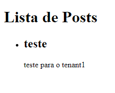

## Multi-Tenant Posts

Com o intuito de exemplificar uma aplicação multi-tenant, nesse projeto busquei realizar uma listagem/criação de posts envolvendo diferentes tenants com base no subdominio.

#### Como utilizar

Para que seja possível rodar os testes na aplicação, é necessário criar os tenants que serão utilizados posteriormente para validações.

Exemplo de criação de tenant no console: 
`Tenant.create(name: 'Tenant 1', subdomain: 'tenant1')`
`Tenant.create(name: 'Tenant 2', subdomain: 'tenant2')`

Com isso já possuimos o necessário para poder acessr o dominio da nossa aplicação através da URL customizada `lvh.me`

`http://tenant1.lvh.me:3000/posts`
`http://tenant2.lvh.me:3000/posts`

É necessário a criação dos posts para cada Tenant a fim de realizar a verificação que cada tenant tera seus próprios posts:

Exemplo de criação de posts no console: 

`Tenant.all.first.posts.create(title: 'teste', body: "teste para o tenant1")`

`Tenant.all.second.posts.create(title: 'teste', body: "teste para o tenant2")`

Com isso ao acessarmos a URL com o subdominio de um tenant existente, devemos visualizar os posts referente somente a aquele tenant: 

Caso tente acessar a rota posts com um subdominio que não exista você sera redirecionado para a rota `/invalid_subdomain`

### Estratégia utilizada

Estamos utilizando uma estratégia onde cada tenant possui um registro na tabela `Tenants` armazenando informações de subdominio e titulo.

Quando uma rota dentro da nossa aplicação é consultada, utilizamos uma verificação do subdominio para realizar a busca pelo tenant responsável ao subdominio repassado.

Caso o subdominio exista em nossa base, vamos renderizar a página posts contendo os posts daquele tenant em questão, caso não exista vamos exibir um erro de dominio inválido.

A exibição dos posts é realizada com um default_scope que permite a busca apenas dos posts responsável ao tenant que está "logado" no momento, o current_tenant.